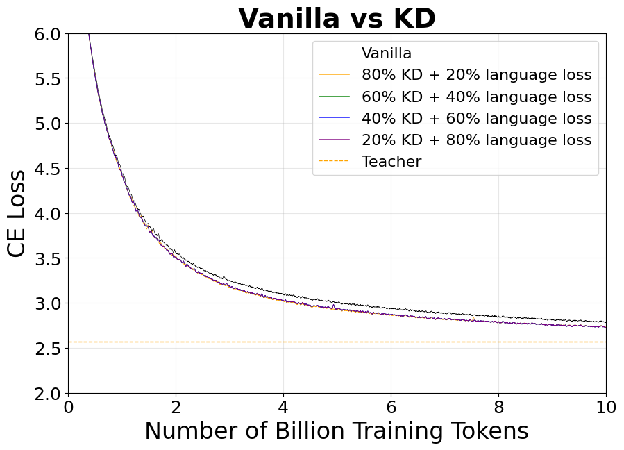

# LLM Knowledge Distillation by MaxText-JAX

This repository is a **fork of [MaxText](https://github.com/google/maxtext)** that implements knowledge distillation capabilities for large language model training. Built on top of MaxText's high-performance JAX/Flax framework, it provides commonly used distillation controls that allow you to transfer knowledge from teacher models to student models during training.

**We gratefully acknowledge the generous support of the Google TPU Research Cloud (TRC), which provided the computational resources used to build this repository.**

## About MaxText

This repository is based on [MaxText](https://github.com/google/maxtext), Google's high-performance, highly scalable, open-source LLM training framework written in pure Python/JAX and targeting Google Cloud TPUs and GPUs. MaxText achieves high MFUs and scales from single host to very large clusters while staying simple and "optimization-free" thanks to the power of JAX and the XLA compiler.

**Original MaxText Repository:** https://github.com/google/maxtext  
**MaxText License:** Apache License 2.0  
**Framework:** JAX/Flax with XLA compilation

## Differences from Original MaxText

This fork extends the original MaxText with the following knowledge distillation features:

- **Knowledge Distillation Loss**: Implements KL divergence between teacher and student logits
- **Teacher Distribution Filtering**: Top-k and nucleus sampling for teacher probability pruning  
- **Flexible Loss Mixing**: Configurable alpha parameter to blend cross-entropy and distillation losses
- **Hard Label Support**: Option to use teacher's argmax predictions instead of soft distributions
- **OTHER Bucket Handling**: Choice between renormalization and "OTHER" bucket for pruned probability mass
- **Temperature Scaling**: Configurable temperature for knowledge distillation
- **Backward Compatibility**: All distillation features are opt-in with sensible defaults

The core MaxText functionality remains unchanged, ensuring compatibility with existing training pipelines while adding powerful distillation capabilities.

## Overview

MaxText's training loop now includes opt-in knowledge distillation (KD) controls that enable:

- **Teacher distribution pruning** with top-k or top-p (nucleus) filtering
- **Flexible probability handling** - decide whether pruned probability mass should form an "OTHER" bucket
- **Hard-label fallback** when you only trust the teacher's argmax predictions
- **Backward compatibility** - all flags default to legacy values, so existing workloads behave exactly as before

### Training Results

The following figure demonstrates knowledge distillation training results across different KD parameter configurations:



*Training loss curves showing convergence behavior across different distillation configurations. The curves demonstrate how different alpha values (distillation strength) affect the learning dynamics during knowledge distillation.*

The experiment explores different combinations of knowledge distillation loss and cross-entropy loss, from KD loss only to all language loss only, showing how distillation strength affects learning dynamics and final performance.

These results can be replicated using the scripts in the [quickstart](quickstart/) folder.


## Quick Start

### Basic Knowledge Distillation

```bash
python MaxText/train.py base.yml \
  use_kd=true \
  kd_teacher_parameters_path=gs://bucket/teacher \
  kd_alpha=0.3 \
  kd_temperature=2.0 \
  kd_top_p=0.9 \
  kd_use_other_bucket=true
```

## Configuration Parameters

| Parameter | Type / Default | Description |
|-----------|----------------|-------------|
| `use_kd` | bool / `false` | Enables KD alongside the standard next-token NLL |
| `kd_teacher_parameters_path` | str / `""` | Location of the frozen teacher parameters; if left empty, the initialized student snapshot acts as the teacher |
| `kd_alpha` | float / `0.5` | Linear blend between the hard-label CE and the KD loss (`0` = CE only, `1` = KD only) |
| `kd_temperature` | float / `1.0` | Softmax temperature applied to both student and teacher logits before the KD loss is evaluated |
| `kd_top_k` | int / `0` | Keeps only the `k` highest-probability teacher tokens per position when KD runs; `0` disables the filter |
| `kd_top_p` | float / `0.0` | Keeps the smallest set of teacher tokens whose cumulative probability ≥ `p` (nucleus sampling); `0.0` disables the filter |
| `kd_use_other_bucket` | bool / `false` | When KD truncates, aggregates the discarded teacher probability mass into a single "OTHER" bucket so the student is penalized for spilling probability outside the retained subset |
| `kd_use_hard_labels` | bool / `false` | Replaces the soft teacher distribution with the teacher's argmax one-hot labels while still mixing with CE via `kd_alpha` |

## Getting Started

For basic MaxText setup and usage, refer to [README_maxtext.md](README_maxtext.md).

## Implementation Details

### Configuration Setup

The KD parameters are configured in `MaxText/configs/base.yml`:

```yaml
kd_top_k: 0                 # default 0 -> keep full teacher distribution (no top-k truncation)
kd_top_p: 0.0               # default 0.0 -> disable nucleus filtering until explicitly set
kd_use_other_bucket: False  # default False -> renormalize kept tokens; no OTHER bucket
kd_use_hard_labels: False  # default False -> stick with soft KD unless opt-in
```

### Runtime Validation

The system includes comprehensive validation in `MaxText/pyconfig.py`:

```python
if keys.get("use_kd", False):                                # only validate extra knobs when KD is requested
  assert 0.0 <= keys.get("kd_alpha", 0.5) <= 1.0, "kd_alpha must be in [0,1]"
  assert keys.get("kd_temperature", 1.0) > 0.0, "kd_temperature must be > 0"
  assert keys.get("kd_teacher_parameters_path", ""), (      # keep legacy requirement for teacher checkpoint
      "use_kd=True requires kd_teacher_parameters_path to be set to a valid checkpoint path"
  )
  top_k = keys.get("kd_top_k", 0)                            # pull configured top-k (0 means disabled)
  top_p = keys.get("kd_top_p", 0.0)                          # pull configured top-p (0.0 means disabled)
  if top_k < 0:
    raise ValueError("kd_top_k must be >= 0")                # guard against negative k
  if top_p < 0.0 or top_p > 1.0:
    raise ValueError("kd_top_p must be within [0, 1]")       # nucleus threshold must be a valid probability
  if top_k > 0 and top_p > 0.0:
    raise ValueError("kd_top_k and kd_top_p are mutually exclusive; set only one of them.")
```

### KD Loss Computation

The knowledge distillation loss is computed in `MaxText/train.py`:

```python
target_mask = data["targets_segmentation"] != 0                      # identify non-padding tokens for masking
one_hot_targets = jax.nn.one_hot(data["targets"], config.vocab_size)  # hard labels for base CE
xent, _ = max_utils.cross_entropy_with_logits(logits, one_hot_targets, 0.0)  # per-token CE vs ground truth
xent = nn.with_logical_constraint(xent, ("activation_embed_and_logits_batch", "activation_length"))  # keep sharding metadata
xent = xent * target_mask                                             # drop padding positions from CE
total_ce = jnp.sum(xent)                                              # aggregate CE over real tokens
total_weights = jnp.sum(target_mask)                                  # count contributing tokens
hard_loss = total_ce / (total_weights + EPS)                          # average CE with epsilon safety

kd_temperature = getattr(config, "kd_temperature", 1.0)              # read temperature (default 1.0)
kd_alpha = getattr(config, "kd_alpha", 0.5)                          # mixing coefficient between CE and KD
kd_top_k = getattr(config, "kd_top_k", 0)                            # optional top-k truncation value
kd_top_p = getattr(config, "kd_top_p", 0.0)                          # optional top-p threshold
kd_use_other_bucket = getattr(config, "kd_use_other_bucket", False)  # whether to aggregate pruned mass
kd_use_hard_labels = getattr(config, "kd_use_hard_labels", False)    # whether to use teacher argmax labels

if kd_use_hard_labels:                                                # hard-label KD branch
  teacher_argmax = jnp.argmax(teacher_logits, axis=-1)                # pick teacher token with max logit per position
  teacher_targets = jax.nn.one_hot(teacher_argmax, config.vocab_size) # convert to one-hot for CE helper reuse
  kd_xent, _ = max_utils.cross_entropy_with_logits(logits, teacher_targets, 0.0)  # student CE vs teacher argmax
  kd_xent = nn.with_logical_constraint(kd_xent, ("activation_embed_and_logits_batch", "activation_length"))  # preserve logical axes
  kd_xent = kd_xent * target_mask                                     # ignore padding tokens in KD term
  total_kd = jnp.sum(kd_xent)                                         # sum KD CE over the batch
  kd_loss = total_kd / (total_weights + EPS)                          # average KD CE (no T^2 scaling for hard labels)
else:                                                                 # soft KD (KL) branch
  top_k_arg = int(kd_top_k) if kd_top_k and kd_top_k > 0 else None    # normalize sentinel 0 to None for helper
  top_p_arg = float(kd_top_p) if kd_top_p and kd_top_p > 0.0 else None  # same for top-p sentinel
  kd_kl = max_utils.kl_divergence_between_logits(                     # compute KL(teacher || student)
      logits,
      teacher_logits,
      kd_temperature,
      top_k=top_k_arg,
      top_p=top_p_arg,
      use_other_bucket=kd_use_other_bucket,
  )
  kd_kl = kd_kl * target_mask                                        # mask padding tokens from KD term
  total_kd = jnp.sum(kd_kl)                                          # sum KL across tokens
  kd_loss = (total_kd / (total_weights + EPS)) * (kd_temperature * kd_temperature)  # average + T^2 scaling

loss = (1.0 - kd_alpha) * hard_loss + kd_alpha * kd_loss             # blend CE and KD using kd_alpha
```

### KL Divergence Helper

The core KL divergence computation is implemented in `MaxText/max_utils.py`:

```python
def kl_divergence_between_logits(
    student_logits: jnp.ndarray,
    teacher_logits: jnp.ndarray,
    temperature: float,
    top_k: Optional[int] = None,
    top_p: Optional[float] = None,
    use_other_bucket: bool = False,
) -> jnp.ndarray:                                                       # expose truncation knobs + OTHER bucket flag
  inv_t = 1.0 / temperature                                             # compute inverse temperature once
  student_log_probs = jax.nn.log_softmax(student_logits * inv_t, axis=-1)          # student log-probs at temp T
  teacher_log_probs_full = jax.nn.log_softmax(teacher_logits * inv_t, axis=-1)     # teacher log-probs at same temp
  teacher_probs_full = jnp.exp(teacher_log_probs_full)                             # convert teacher logits to probs

  vocab_size = teacher_probs_full.shape[-1]
  if top_k is not None and top_k <= 0:
    top_k = None                                                        # treat non-positive k as "no truncation"
  if top_k is not None and top_k >= vocab_size:
    top_k = None                                                        # requesting >= vocab is equivalent to no truncation
  if top_p is not None and top_p <= 0.0:
    top_p = None                                                        # zero/negative nucleus threshold -> disable
  if top_p is not None and top_p >= 1.0:
    top_p = None                                                        # p >= 1 keeps everything; collapse to disable

  if top_k is None and top_p is None:
    return jnp.sum(teacher_probs_full * (teacher_log_probs_full - student_log_probs), axis=-1)  # original KL path

  probs_shape = teacher_probs_full.shape
  flat_teacher_probs = teacher_probs_full.reshape((-1, vocab_size))      # flatten batch/time for lax.top_k convenience

  def _scatter_mask(indices: jnp.ndarray, values: jnp.ndarray) -> jnp.ndarray:
    row_ids = jnp.arange(indices.shape[0])[:, None]                     # row coordinates for scatter
    mask = jnp.zeros_like(flat_teacher_probs, dtype=bool)               # start with all False
    return mask.at[row_ids, indices].set(values)                        # set selected token positions to True

  if top_k is not None:
    k = int(top_k)
    _, top_indices = jax.lax.top_k(flat_teacher_probs, k)               # find top-k indices per row
    mask_flat = _scatter_mask(top_indices, jnp.ones_like(top_indices, dtype=bool))  # mark kept tokens True
  else:
    sorted_probs, sorted_indices = jax.lax.top_k(flat_teacher_probs, vocab_size)   # sort probs descending
    cumulative = jnp.cumsum(sorted_probs, axis=-1)                      # running sum for nucleus computation
    prev_cumulative = cumulative - sorted_probs                         # mass before current token
    keep_sorted = prev_cumulative < float(top_p)                        # keep tokens while mass < p
    mask_flat = _scatter_mask(sorted_indices, keep_sorted)              # scatter nucleus mask back to vocab order

  mask = mask_flat.reshape(probs_shape)                                 # restore original batch/time shape
  full_dtype = teacher_probs_full.dtype
  mask_f = mask.astype(full_dtype)                                      # cast mask for arithmetic with probs
  eps = jnp.finfo(full_dtype).eps                                       # small epsilon for numerical stability

  if use_other_bucket:
    kept_teacher_probs = teacher_probs_full * mask_f                    # zero out dropped teacher probs
    teacher_other_prob = jnp.sum(teacher_probs_full * (1.0 - mask_f), axis=-1)  # collect discarded teacher mass
    teacher_other_log_prob = jnp.log(jnp.maximum(teacher_other_prob, eps))       # log prob for OTHER bucket

    student_probs = jnp.exp(student_log_probs)                          # student probabilities (already temp scaled)
    student_other_prob = jnp.sum(student_probs * (1.0 - mask_f), axis=-1)         # student mass outside kept set
    student_other_log_prob = jnp.log(jnp.maximum(student_other_prob, eps))        # log prob for student OTHER bucket

    kl_kept = jnp.sum(kept_teacher_probs * (teacher_log_probs_full - student_log_probs), axis=-1)  # KL over retained tokens
    kl_other = teacher_other_prob * (teacher_other_log_prob - student_other_log_prob)               # KL for OTHER bucket
    return kl_kept + kl_other                                            # combine contributions

  masked_probs = teacher_probs_full * mask_f                             # zero out discarded teacher probs
  denom = jnp.sum(masked_probs, axis=-1, keepdims=True)                  # total mass of kept tokens
  denom = jnp.maximum(denom, eps)                                        # avoid dividing by zero
  renorm_teacher_probs = masked_probs / denom                            # renormalize kept tokens to sum to 1
  renorm_teacher_log_probs = jnp.log(jnp.maximum(renorm_teacher_probs, eps))  # convert to log probs safely
  return jnp.sum(renorm_teacher_probs * (renorm_teacher_log_probs - student_log_probs), axis=-1)  # KL on renormalized subset
```

## Testing

The implementation includes comprehensive test coverage in `MaxText/tests/max_utils_test.py`:

```python
class KlDivergenceBetweenLogitsTest(unittest.TestCase):                 # focused tests for new KD helper behaviors

  def test_topk_truncation_renormalize(self):
    student_probs = jnp.array([0.4, 0.4, 0.2], dtype=jnp.float32)       # deterministic student distribution
    teacher_probs = jnp.array([0.6, 0.3, 0.1], dtype=jnp.float32)       # deterministic teacher distribution
    student_logits = jnp.log(student_probs).reshape(1, 1, -1)           # convert to logits for helper
    teacher_logits = jnp.log(teacher_probs).reshape(1, 1, -1)

    actual = max_utils.kl_divergence_between_logits(                    # run helper with top_k=2
        student_logits,
        teacher_logits,
        temperature=1.0,
        top_k=2,
    )
    actual_val = float(actual[0, 0])                                    # extract scalar KL value

    renorm_teacher = jnp.array([2.0 / 3.0, 1.0 / 3.0], dtype=jnp.float32)  # manual renormalization of top-2 teacher mass
    expected_val = float(
        jnp.sum(
            renorm_teacher
            * (
                jnp.log(renorm_teacher)
                - jnp.log(student_probs[:2])
            )
        )
    )

    self.assertAlmostEqual(actual_val, expected_val, places=6)          # confirm helper matches analytic KL

  def test_topp_with_other_bucket(self):
    student_probs = jnp.array([0.45, 0.25, 0.2, 0.1], dtype=jnp.float32)
    teacher_probs = jnp.array([0.5, 0.25, 0.15, 0.1], dtype=jnp.float32)
    student_logits = jnp.log(student_probs).reshape(1, 1, -1)
    teacher_logits = jnp.log(teacher_probs).reshape(1, 1, -1)

    actual = max_utils.kl_divergence_between_logits(                    # run helper with top_p nucleus + OTHER bucket
        student_logits,
        teacher_logits,
        temperature=1.0,
        top_p=0.7,
        use_other_bucket=True,
    )
    actual_val = float(actual[0, 0])

    expected_kept = float(                                              # analytic KL over kept tokens (0.5, 0.25)
        0.5 * (jnp.log(0.5) - jnp.log(0.45))
        + 0.25 * (jnp.log(0.25) - jnp.log(0.25))
    )
    teacher_other = 0.15 + 0.1                                         # teacher probability collapsed into OTHER bucket
    student_other = 0.2 + 0.1                                          # student probability in OTHER bucket
    expected_other = float(teacher_other * (jnp.log(teacher_other) - jnp.log(student_other)))  # analytic OTHER KL
    expected_val = expected_kept + expected_other

    self.assertAlmostEqual(actual_val, expected_val, places=6)          # verify helper matches analytic result
```

## Results

### Training Configurations

The repository includes several distillation experiments with different alpha values (distillation strength):

| Configuration | Model | Teacher | Student | Alpha | Temperature | Dataset |
|---------------|-------|---------|---------|-------|-------------|---------|
| `alpha_02` | Llama 3.1-1B | 25B Teacher | 1B Student | 0.2 | 1.0 | FineWeb-Edu |
| `alpha_04` | Llama 3.1-1B | 25B Teacher | 1B Student | 0.4 | 1.0 | FineWeb-Edu |
| `alpha_06` | Llama 3.1-1B | 25B Teacher | 1B Student | 0.6 | 1.0 | FineWeb-Edu |
| `alpha_08` | Llama 3.1-1B | 25B Teacher | 1B Student | 0.8 | 1.0 | FineWeb-Edu |
| `alpha_1` | Llama 3.1-1B | 25B Teacher | 1B Student | 1.0 | 1.0 | FineWeb-Edu |
| `hard_alpha_1` | Llama 3.1-1B | 25B Teacher | 1B Student | 1.0 | 1.0 | FineWeb-Edu (Hard Labels) |

### Training Parameters

- **Model**: Llama 3.1-1B (student), 25B teacher
- **Sequence Length**: 8,192 tokens
- **Batch Size**: 4 per device
- **Learning Rate**: 3e-4
- **Steps**: 25,000
- **Dataset**: FineWeb-Edu (educational subset)
- **Hardware**: Google Cloud TPUs


## Key Features

- **Flexible Teacher-Student Setup**: Use pre-trained teacher models or initialize student as teacher
- **Advanced Filtering**: Top-k and nucleus sampling for teacher distribution pruning
- **Probability Mass Handling**: Choose between renormalization and "OTHER" bucket aggregation
- **Hard vs Soft Labels**: Support for both soft KL divergence and hard label imitation
- **Temperature Scaling**: Configurable temperature for knowledge distillation
- **Backward Compatibility**: All new features are opt-in with sensible defaults

## Usage Examples

### Basic Distillation
```bash
python MaxText/train.py base.yml \
  use_kd=true \
  kd_teacher_parameters_path=gs://bucket/teacher_checkpoint \
  kd_alpha=0.5
```

### Advanced Distillation with Filtering
```bash
python MaxText/train.py base.yml \
  use_kd=true \
  kd_teacher_parameters_path=gs://bucket/teacher_checkpoint \
  kd_alpha=0.3 \
  kd_temperature=2.0 \
  kd_top_p=0.9 \
  kd_use_other_bucket=true
```

### Hard Label Distillation
```bash
python MaxText/train.py base.yml \
  use_kd=true \
  kd_teacher_parameters_path=gs://bucket/teacher_checkpoint \
  kd_alpha=0.7 \
  kd_use_hard_labels=true
```
